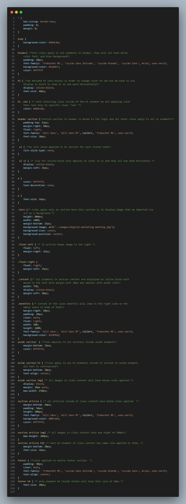

# **Horiseon-project**


## Description
This code is written to follow accessibility standards
with semantically correct HTML code. CSS was optimized in order to minify, and compress the code while still keeping the original web appearance and functionality.

---

## Installation
* Clone the repository  
```
git clone git@github.com:Jelenarog/Horiseon-project.git
```

---
## Usage 
Project allows us to take us to certain section of the web page by clicking on link it header with using links to specific class we want the web page to navigate to. One image is used as background while other sections are shown as inline blocks. Using semantic elements in CSS we applied same style to all elements we anticipated to make changes to without repeating the code.




---
## Credits

https://github.com/coding-boot-camp/urban-octo-telegram

---
## License 
Please refer to the LICENSE in the repo.

---


